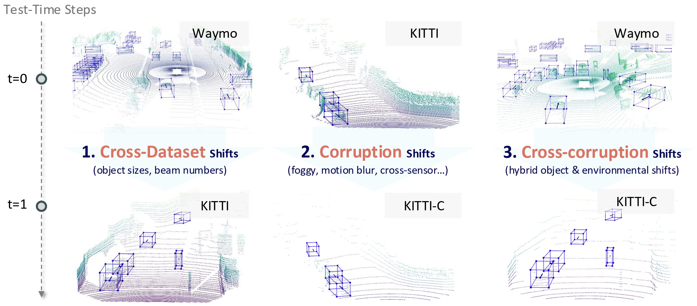

# MOS: Model Synergy for Test-Time Adaptation on LiDAR-Based 3D Object Detection

Code release for the work: **MOS: Model Synergy for Test-Time Adaptation on LiDAR-Based 3D Object Detection** publish in **ICLR 2025** as an **Oral** paper! [[paper link]](https://openreview.net/forum?id=Y6aHdDNQYD)



## Abstract
LiDAR-based 3D object detection is crucial for various applications but often experiences performance degradation in real-world deployments due to domain shifts. While most studies focus on cross-dataset shifts, such as changes in environments and object geometries, practical corruptions from sensor variations and weather conditions remain underexplored. In this work, we propose a novel online test-time adaptation framework for 3D detectors that effectively tackles these shifts, including a challenging cross-corruption scenario where cross-dataset shifts and corruptions co-occur. By leveraging long-term knowledge from previous test batches, our approach mitigates catastrophic forgetting and adapts effectively to diverse shifts. Specifically, we propose a Model Synergy (MOS) strategy that dynamically selects historical checkpoints with diverse knowledge and assembles them to best accommodate the current test batch. This assembly is directed by our proposed Synergy Weights (SW), which perform a weighted averaging of the selected checkpoints, minimizing redundancy in the composite model. The SWs are computed by evaluating the similarity of predicted bounding boxes on the test data and the independence of features between checkpoint pairs in the model bank. To maintain an efficient and informative model bank, we discard checkpoints with the lowest average SW scores, replacing them with newly updated models. Our method was rigorously tested against existing test-time adaptation strategies across three datasets and eight types of corruptions, demonstrating superior adaptability to dynamic scenes and conditions. Notably, it achieved a 67.3% improvement in a challenging cross-corruption scenario, offering a more comprehensive benchmark for adaptation.

## Installation

### Environment

All the codes are tested in the following environment:
* Linux (tested on Ubuntu 18.04.6 LTS)
* Python 3.8
* PyTorch 1.10.1
* CUDA 11.3
* [spconv-cu113 v2.3.6](https://github.com/traveller59/spconv)

All packages/libraries tested for this project have been exported to in [environment.yml](environment.yml).

Note: [wandb](https://docs.wandb.ai/quickstart) is required to record the information during adaptation.

### Install  `pcdet v0.3`
NOTE: Please re-install `pcdet v0.3` by running `python setup.py develop` even if you have already installed previous version.

[//]: # ()
[//]: # (a. Clone this repository.)

[//]: # (```shell)

[//]: # (git clone ... TODO)

[//]: # (```)

a. Install the dependent libraries as follows:

* Install the dependent python libraries: 
```
conda env create -f environment.yml
```

b. Install this `pcdet` library by running the following command:
```shell
python setup.py develop
```


## Dataset Preparation

Currently we provide the dataloader of KITTI dataset and NuScenes dataset, and the supporting of more datasets are on the way.  

### KITTI Dataset
* Please download the official [KITTI 3D object detection](http://www.cvlibs.net/datasets/kitti/eval_object.php?obj_benchmark=3d) dataset and organize the downloaded files as follows (the road planes could be downloaded from [[road plane]](https://drive.google.com/file/d/1d5mq0RXRnvHPVeKx6Q612z0YRO1t2wAp/view?usp=sharing), which are optional for data augmentation in the training):
* NOTE: if you already have the data infos from `pcdet v0.1`, you can choose to use the old infos and set the DATABASE_WITH_FAKELIDAR option in tools/cfgs/dataset_configs/kitti_dataset.yaml as True. The second choice is that you can create the infos and gt database again and leave the config unchanged.

```
OpenPCDet
├── data
│   ├── kitti
│   │   │── ImageSets
│   │   │── training
│   │   │   ├──calib & velodyne & label_2 & image_2 & (optional: planes)
│   │   │── testing
│   │   │   ├──calib & velodyne & image_2
├── pcdet
├── tools
```

* Generate the data infos by running the following command: 
```python 
python -m pcdet.datasets.kitti.kitti_dataset create_kitti_infos tools/cfgs/dataset_configs/kitti_dataset.yaml
```


### KITTI-C Dataset
Please follow [Robo3D](https://github.com/ldkong1205/Robo3D) to download and prepare the KITTI-C dataset.


### NuScenes Dataset
* Please download the official [NuScenes 3D object detection dataset](https://www.nuscenes.org/download) and 
organize the downloaded files as follows: 
```
OpenPCDet
├── data
│   ├── nuscenes
│   │   │── v1.0-trainval (or v1.0-mini if you use mini)
│   │   │   │── samples
│   │   │   │── sweeps
│   │   │   │── maps
│   │   │   │── v1.0-trainval  
├── pcdet
├── tools
```

* Install the `nuscenes-devkit` with version `1.0.5` by running the following command: 
```shell script
pip install nuscenes-devkit==1.0.5
```

* Generate the data infos by running the following command (it may take several hours): 
```python 
python -m pcdet.datasets.nuscenes.nuscenes_dataset --func create_nuscenes_infos \ 
    --cfg_file tools/cfgs/dataset_configs/nuscenes_dataset.yaml \
    --version v1.0-trainval
```

### Waymo Open Dataset
* Please download the official [Waymo Open Dataset](https://waymo.com/open/download/), 
including the training data `training_0000.tar~training_0031.tar` and the validation 
data `validation_0000.tar~validation_0007.tar`.
* Unzip all the above `xxxx.tar` files to the directory of `data/waymo/raw_data` as follows (You could get 798 *train* tfrecord and 202 *val* tfrecord ):  
```
OpenPCDet
├── data
│   ├── waymo
│   │   │── ImageSets
│   │   │── raw_data
│   │   │   │── segment-xxxxxxxx.tfrecord
|   |   |   |── ...
|   |   |── waymo_processed_data
│   │   │   │── segment-xxxxxxxx/
|   |   |   |── ...
│   │   │── pcdet_gt_database_train_sampled_xx/
│   │   │── pcdet_waymo_dbinfos_train_sampled_xx.pkl   
├── pcdet
├── tools
```
* Install the official `waymo-open-dataset` by running the following command: 
```shell script
pip3 install --upgrade pip
# tf 2.0.0
pip3 install waymo-open-dataset-tf-2-0-0==1.2.0 --user
```

* Extract point cloud data from tfrecord and generate data infos by running the following command (it takes several hours, 
and you could refer to `data/waymo/waymo_processed_data` to see how many records that have been processed): 
```python 
python -m pcdet.datasets.waymo.waymo_dataset --func create_waymo_infos \
    --cfg_file tools/cfgs/dataset_configs/waymo_dataset.yaml
```

Note that you do not need to install `waymo-open-dataset` if you have already processed the data before and do not need to evaluate with official Waymo Metrics. 

## Get Started!

The dataset configs are located within [tools/cfgs/dataset_configs](../tools/cfgs/dataset_configs), 
and the TTA configs are located within [tools/cfgs/tta_](../tools/cfgs) for different tta tasks.


### Pretrain models on the source domain
```shell script
python train.py --cfg_file ${CONFIG_FILE}
```

For example, pretrain a model on Waymo for TTA on KITTI:
```shell script
python train.py --cfg_file cfgs/tta_w2k_models/secondiou/source_pretrain.yaml \
    --batch_size ${BATCH_SIZE}
```

### Test pretained models

* Test with a pretrained model: 
```shell script
python test.py --cfg_file ${CONFIG_FILE} --batch_size ${BATCH_SIZE} --ckpt ${CKPT}
```

* To test all the saved checkpoints of a specific training setting and draw the performance curve on the Tensorboard, add the `--eval_all` argument: 
```shell script
python test.py --cfg_file ${CONFIG_FILE} --batch_size ${BATCH_SIZE} --eval_all
```

* Notice that if you want to test on the setting with KITTI as **target domain**, 
  please add `--set DATA_CONFIG_TAR.FOV_POINTS_ONLY True` to enable front view
  point cloud only: 
```shell script
python test.py --cfg_file ${CONFIG_FILE} --batch_size ${BATCH_SIZE} --eval_all --set DATA_CONFIG_TAR.FOV_POINTS_ONLY True
```

### Test-Time Adaptation on the target domain
You need to set the `--pretrained_model ${PRETRAINED_MODEL}` to your model pre-trained on the source domain.
```shell script
python train.py --cfg_file cfgs/tta_w2k_models/secondiou/mos.yaml \
    --batch_size ${BATCH_SIZE} --pretrained_model ${PRETRAINED_MODEL}
```

Then test the ckpt 
```shell script
python tet_tta.py --cfg_file cfgs/tta_w2k_models/secondiou/mos.yaml \
    --batch_size ${BATCH_SIZE} --eval_all
```

## Acknowledgement

Our code is heavily based on and [ST3D](https://github.com/CVMI-Lab/ST3D) and [OpenPCDet v0.3](https://github.com/open-mmlab/OpenPCDet/commit/e3bec15f1052b4827d942398f20f2db1cb681c01). Thanks for their awesome codebase.
